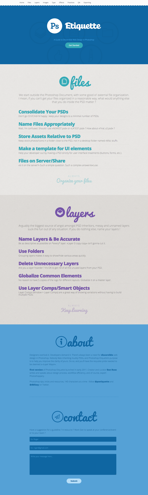

# CSS "Photoshop Etiquette"

> CSS exercise given at HEPL

* * *

**CSS "Photoshop Etiquette"** is an educational project, which will be used for `HTML`/`CSS` courses.

**Note:** the school where the course is given, the [HEPL](http://www.provincedeliege.be/hauteecole) from Liège, Belgium, is a french-speaking school. From this point, the instruction will be in french. Sorry.

* * *

> Lors de vos labos de *travaux dirigés*, vous allez découvrir le langage CSS et le mettre en pratique via de courts exercices de mise en situation.  
> Les labos de *travaux pratiques* vont vous confronter à des exercices pratiques et individuels reprenant la matière vue lors du TD précédent.

* * *

## Photoshop Etiquette

Vous trouverez dans ce dossier une page HTML nommée **index.html**. Cette page est tirée de la première version de l'excellent site [Photoshop Etiquette](http://photoshopetiquette.com) par [Dan Rose](http://danroseonline.com).

Le rendu final désiré est le suivant : 

### Consignes

* Lier le fichier **styles.css** à la page **index.html**.
* En vous fiant aux sections présentes dans le fichier **styles.css** et au rendu attendu, compléter la feuille de styles.
* Toutes les images à utiliser se trouvent dans le dossier **img**.
* Bon travail et bon amusement&nbsp;!

* * *

### Références

La version originale du site a été créée en 2011 par [Dan Rose](http://danroseonline.com).  
Elle n'est malheureusement plus en ligne et a été remplacée depuis par [une version remise au goût du jour](http://photoshopetiquette.com).

Adaptation du code par [Myriam Dupont](https://github.com/myriamdupont) & [François Parmentier](https://github.com/dkmpbe).
